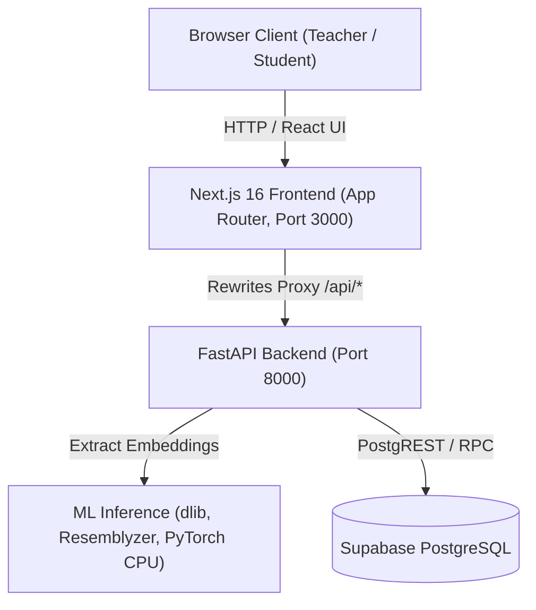

# SnapClass Deployment & Architecture Guide

SnapClass is an automated classroom attendance platform powered by facial recognition and speaker voice verification. It is architected as a decoupled system featuring a **FastAPI backend** (`backend/`) and a **Next.js 16 frontend** (`frontend/`), backed by **Supabase PostgreSQL**.

---

## 1. System Architecture



- **Frontend (`frontend/`)**: Next.js 16 App Router, Tailwind CSS, Lucide Icons, HTML5 camera snapshot & `MediaRecorder` audio capture. Same-origin proxy rewrites forward `/api/*` to the backend.
- **Backend (`backend/`)**: FastAPI with asynchronous endpoints, safe Pydantic models (biometric embeddings never exposed), signed `httpOnly` session cookies (`itsdangerous`), and atomic rate-limiting lockout storage.
- **Biometric Pipelines**: `dlib` facial landmark embeddings (128-d) and `resemblyzer` voice verification embeddings (256-d).
- **Database (`supabase/`)**: PostgreSQL with RLS and SECURITY DEFINER RPCs for atomic operations.

---

## 2. Environment Variables

Create a `.env` file in the project root or configure these variables in your deployment environment:

| Variable | Description | Default / Example |
| :--- | :--- | :--- |
| `SUPABASE_URL` | Supabase Project URL | `https://your-project.supabase.co` |
| `SUPABASE_KEY` | Supabase Anon Key | `eyJhbGciOi...` |
| `SUPABASE_SERVICE_ROLE_KEY` | Supabase Service Role Key (required for lockout RPC) | `eyJhbGciOi...` |
| `SESSION_SECRET` | Secret key used to sign `httpOnly` session cookies | High-entropy 32+ char string |
| `LOCKOUT_SECRET` | Secret key used for HMAC-SHA256 hashing of device/IP keys | High-entropy 32+ char string |
| `DEV_MODE` | Allow startup with mock keys during local development / testing | `false` (set `true` only for dev/CI) |
| `COOKIE_SECURE` | Set `Secure` attribute on cookies | `true` in production (requires HTTPS) |
| `CORS_ORIGINS` | Permitted CORS origins (comma-separated) | `http://localhost:3000,http://127.0.0.1:3000` |
| `BACKEND_URL` | Used by Next.js to proxy `/api/*` requests | `http://127.0.0.1:8000` (or `http://backend:8000` in Docker) |

---

## 3. Database Migrations

Apply the migration scripts located in [supabase/migrations/](file:///Users/shravanmole/Documents/snapclass/supabase/migrations/):

1. **`20261005000000_full_base_schema.sql`**: Core tables (`teachers`, `students`, `subjects`, `subject_students`, `attendance_logs`) and indexes.
2. **`20261006000000_create_login_attempts.sql`**: Initial `login_attempts` table for lockout tracking.
3. **`20261006000001_harden_login_attempts.sql`**: Hardened atomic upsert `record_login_attempt` with `p_window_seconds`, active lock retention, `cleanup_expired_login_attempts`, and strict `service_role` security definitions.

Execute through the Supabase Dashboard SQL Editor or via the Supabase CLI:
```bash
supabase db push
```

---

## 4. Local Development Setup

### 4.1. Prerequisites
- Python 3.11+
- Node.js 20+
- `ffmpeg` installed on your system (e.g. `brew install ffmpeg` on macOS or `apt install ffmpeg` on Linux)
- `cmake` & `build-essential` (for compiling `dlib`)

### 4.2. Backend Setup
```bash
# Create and activate virtual environment
python3 -m venv venv
source venv/bin/activate

# Install CPU-only torch and requirements
pip install --index-url https://download.pytorch.org/whl/cpu torch torchaudio
pip install -r backend/requirements.txt

# Start FastAPI development server
cd backend
uvicorn app.main:app --reload --port 8000
```
Backend will be available at `http://127.0.0.1:8000/api/health`.

### 4.3. Frontend Setup
```bash
cd frontend

# Install dependencies
npm install

# Start Next.js development server
npm run dev
```
Frontend will be available at `http://localhost:3000`.

---

## 5. Docker & Docker Compose Deployment

Both services can be launched with a single command via [docker-compose.yml](file:///Users/shravanmole/Documents/snapclass/docker-compose.yml):

```bash
# Build and start both containers
docker compose up --build -d

# View logs
docker compose logs -f

# Shut down
docker compose down
```

The `backend` container builds with CPU-only PyTorch to minimize image size and runs a built-in health check on `/api/health`. The `frontend` container waits until the backend healthcheck passes before serving traffic.

---

## 6. Testing & Quality Verification

### 6.1. Logic Drift Check
Ensures absolute parity between legacy Streamlit code and backend services:
```bash
bash scripts/check_logic_drift.sh
```

### 6.2. Python Unit & Characterization Tests
```bash
# Root characterization suite (69 tests)
source venv/bin/activate
python -m unittest discover -s tests -v

# Backend service, auth, and model suite (42 tests)
cd backend
python -m unittest discover -s tests -v
```

### 6.3. Frontend Production Build
```bash
cd frontend
npm run build
```
