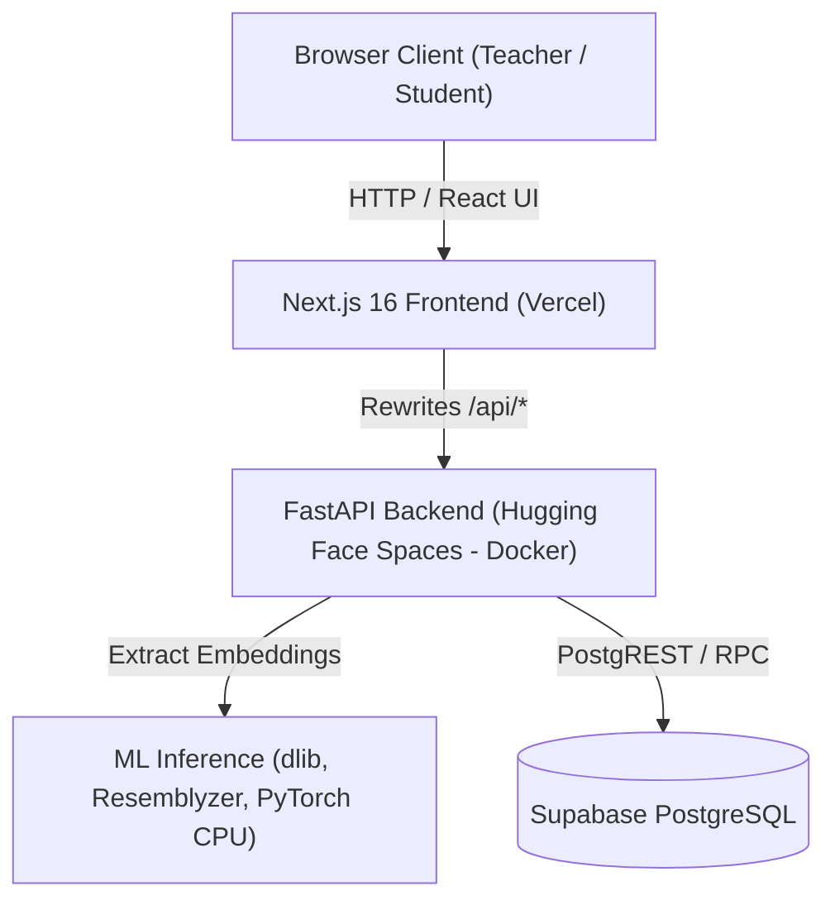

# SnapClass Deployment & Architecture Guide

SnapClass is an automated classroom attendance platform powered by facial recognition and speaker voice verification. It is architected as a decoupled system featuring a **FastAPI backend** (`backend/`) and a **Next.js 16 frontend** (`frontend/`), backed by **Supabase PostgreSQL**.

---

## 1. System Architecture



- **Frontend (`frontend/`)**: Next.js 16 App Router, Tailwind CSS, Lucide Icons, HTML5 camera snapshot & `MediaRecorder` audio capture. Same-origin proxy rewrites forward `/api/*` to `${BACKEND_URL}/api/*`.
- **Backend (`backend/`)**: FastAPI with asynchronous endpoints, safe Pydantic models (biometric embeddings never exposed), signed `httpOnly` session cookies (`itsdangerous`), and atomic rate-limiting lockout storage.
- **Biometric Pipelines**: `dlib` facial landmark embeddings (128-d) and `resemblyzer` voice verification embeddings (256-d).
- **Database (`supabase/`)**: PostgreSQL with RLS and SECURITY DEFINER RPCs for atomic operations.

---

## 2. Environment Variables & Secrets Reference

> [!IMPORTANT]
> **Strict Security Notice**: Never commit, echo, or log secret values in repository files or scripts. Real secret values belong solely in Hugging Face Space "Secrets" and Vercel "Environment Variables".

### 2.1. Backend Secrets (Hugging Face Spaces)

Configure these in Hugging Face Space **Settings > Secrets**:

| Variable Name | Required | Description | Example / Notes |
| :--- | :--- | :--- | :--- |
| `SUPABASE_URL` | **Yes** | Supabase Project URL | `https://xyzproject.supabase.co` |
| `SUPABASE_KEY` | **Yes** | Supabase API key (anon or service key used by DB client) | High-entropy JWT string |
| `SESSION_SECRET` | **Yes** | Key for signing HTTP session cookies (`itsdangerous`) | 32+ char random hex string |
| `LOCKOUT_SECRET` | **Yes** | Key for HMAC-SHA256 device & IP lockout digests | 32+ char random hex string |
| `CORS_ORIGINS` | **Yes** | Allowed origins for CORS (comma-separated) | `https://your-app.vercel.app` |
| `COOKIE_SECURE` | No | Mark session cookies as `Secure` | Defaults to `true` in production |
| `LOCKOUT_IP_MAX_ATTEMPTS` | No | Maximum failed logins per IP before temporary lockout | Defaults to `30` (see Proxy Caveat below) |
| `LOCKOUT_IP_WINDOW_SECONDS` | No | Lockout duration window in seconds for IP backstop | Defaults to `600` (10 minutes) |

*(Note on `SUPABASE_SERVICE_ROLE_KEY`: The codebase only reads this variable in `backend/app/main.py` for an optional startup diagnostic log. Database initialization in `backend/app/config.py` relies on `SUPABASE_KEY` or `SUPABASE_SERVICE_KEY`, so `SUPABASE_SERVICE_ROLE_KEY` is not required for backend operations.)*

### 2.2. Frontend Environment Variables (Vercel)

Configure in Vercel **Project Settings > Environment Variables**:

| Variable Name | Required | Description | Example / Notes |
| :--- | :--- | :--- | :--- |
| `BACKEND_URL` | **Yes** | Base URL of the Hugging Face Space backend | `https://<user>-<space>.hf.space` (no trailing slash) |

---

## 3. Free Deployment Step-by-Step

### Step 1: Create Supabase Project & Apply Migrations
1. Create a free project at [supabase.com](https://supabase.com).
2. Run migrations in the Supabase SQL Editor:
   - `supabase/migrations/20261005000000_full_base_schema.sql`
   - `supabase/migrations/20261006000000_create_login_attempts.sql`
   - `supabase/migrations/20261006000001_harden_login_attempts.sql`
3. Retrieve your Project URL and API Key from **Project Settings > API**.

### Step 2: Deploy Backend to Render.com (100% Free Tier)
Render offers free Docker web services directly connected to your GitHub repository:

1. Log into [dashboard.render.com](https://dashboard.render.com) (sign up with GitHub).
2. Click **New +** > **Blueprint** (or **Web Service**):
   - Select your GitHub repository: `shravan12092005/snapclass` (branch: `feat/ui-split`).
   - If using **Blueprint**: Render detects `render.yaml` automatically and configures all settings and auto-generates secrets!
   - If using **Web Service** manually:
     - **Name**: `snapclass-backend`
     - **Region**: Closest to you (e.g., Singapore / Oregon / Frankfurt)
     - **Branch**: `feat/ui-split`
     - **Root Directory**: `backend`
     - **Runtime**: `Docker`
     - **Instance Type**: **Free**
3. Configure Environment Variables in Render:
   - `SUPABASE_URL`: *(Your Supabase project URL)*
   - `SUPABASE_KEY`: *(Your Supabase API key)*
   - `SESSION_SECRET`: *(32+ char random string, or auto-generated by Blueprint)*
   - `LOCKOUT_SECRET`: *(32+ char random string, or auto-generated by Blueprint)*
   - `CORS_ORIGINS`: `*` *(or your Vercel URL once deployed)*
   - `LOCKOUT_IP_MAX_ATTEMPTS`: `1000`
   - `DEV_MODE`: `false`
4. Click **Create Web Service** (or **Apply Blueprint**).
5. Once deployed, verify your backend health at:
   ```
   https://<your-service-name>.onrender.com/api/health
   ```
   *(Expected response: `{"status": "ok"}`)*

---

### Alternative: Deploy Backend to Hugging Face Spaces (Requires PRO/Paid account for Docker)
*(Note: As of recent policy changes, Hugging Face Spaces requires a paid plan or credit card to create new Docker Spaces)*:
1. Create a Space at [huggingface.co/new-space](https://huggingface.co/new-space) (SDK: Docker, Blank template).
2. Add secrets in **Settings > Variables and secrets**: `SUPABASE_URL`, `SUPABASE_KEY`, `SESSION_SECRET`, `LOCKOUT_SECRET`, `CORS_ORIGINS`.
3. Push via:
```bash
HF_USER="<user>" HF_SPACE="snapclass-backend" HF_TOKEN="<token>" bash scripts/deploy_hf.sh
```

### Step 6: Deploy Frontend to Vercel
1. Log into [Vercel](https://vercel.com) and click **Add New > Project**.
2. Import your GitHub repository.
3. Configure Project Settings:
   - **Framework Preset**: `Next.js`
   - **Root Directory**: `frontend`
   - **Build Command**: `next build` (default)
   - **Output Directory**: `.next` (default)
4. Add Environment Variable:
   - `BACKEND_URL`: `https://<your-hf-username>-snapclass-backend.hf.space` (no trailing slash)
5. Click **Deploy**.

### Step 7: Smoke Tests
1. Visit the generated Vercel URL.
2. Update `CORS_ORIGINS` in Hugging Face Space Secrets to match your final Vercel domain.
3. Verify teacher login / session cookies (`Secure`, `SameSite=Lax`, `HttpOnly`).
4. Perform camera face login or student registration.

---

## 4. Reverse Proxy & Rate Limiting Considerations

In `backend/app/lockout.py`, client IP extraction operates as follows:
- `get_client_ip(request)` reads `request.client.host` (the immediate peer socket address).
- Forwarded headers (`X-Forwarded-For`, `X-Real-IP`) are evaluated **only** if the peer IP is explicitly listed in `TRUSTED_PROXIES`.
- In Hugging Face Spaces, requests arrive through internal cluster proxies/routers whose dynamic IPs are not in `TRUSTED_PROXIES`.
- Consequently, all external requests share the internal proxy IP address for the per-IP rate-limiting backstop.

**Impact & Mitigation:**
- **Per-Device Protection**: Device-level rate limiting (`DEVICE_MAX_FAILURES = 5`) keys off a cryptographically signed cookie (`snapclass_device_id`) and operates independently for each browser client.
- **Per-IP Backstop**: If cumulative failed attempts across multiple clients reach `IP_MAX_FAILURES` (default 30) within 10 minutes, the shared proxy IP could be temporarily locked out.
- **Configurability**: Both `LOCKOUT_IP_MAX_ATTEMPTS` and `LOCKOUT_IP_WINDOW_SECONDS` are configurable via environment variables without modifying application code.
- **Recommendation**: Set `LOCKOUT_IP_MAX_ATTEMPTS=1000` in Hugging Face Space Secrets. This allows the primary per-device rate limiting (5 attempts per device) to protect accounts while preventing unintended platform-wide lockouts on shared proxy IPs.

---

## 5. Free-Tier Caveats & Operational Notes

- **Hugging Face Spaces Inactivity Sleep**: Free-tier Spaces automatically pause after ~48 hours without incoming HTTP traffic. The first request after sleeping will trigger a cold-start spin-up taking ~30–60 seconds before responding.
- **Supabase Project Pausing**: Free-tier Supabase projects automatically pause after 7 consecutive days of inactivity. If paused, unpause the database in the Supabase Dashboard prior to demos.
- **First Docker Build Time**: The initial container build on Hugging Face Spaces compiles `dlib` from C++ source via `cmake` and installs ML dependencies, taking approximately 5–8 minutes. Subsequent deploys use Docker layer caching and complete substantially faster.

---

## 6. Local Development & Docker Compose

For local development or self-hosted server deployment:

```bash
# Start backend on :8000 and frontend on :3000
docker compose up --build -d

# View logs
docker compose logs -f

# Stop containers
docker compose down
```

---

## 7. Quality Verification Commands

```bash
# 1. Verify logic drift between backend and legacy code
bash scripts/check_logic_drift.sh

# 2. Run backend test suite
cd backend && python3 -m unittest discover -s tests -v

# 3. Verify frontend lint and build
cd frontend && npm run lint && npm run build
```
