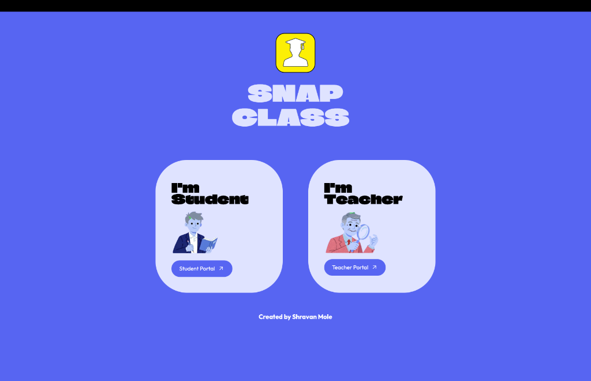
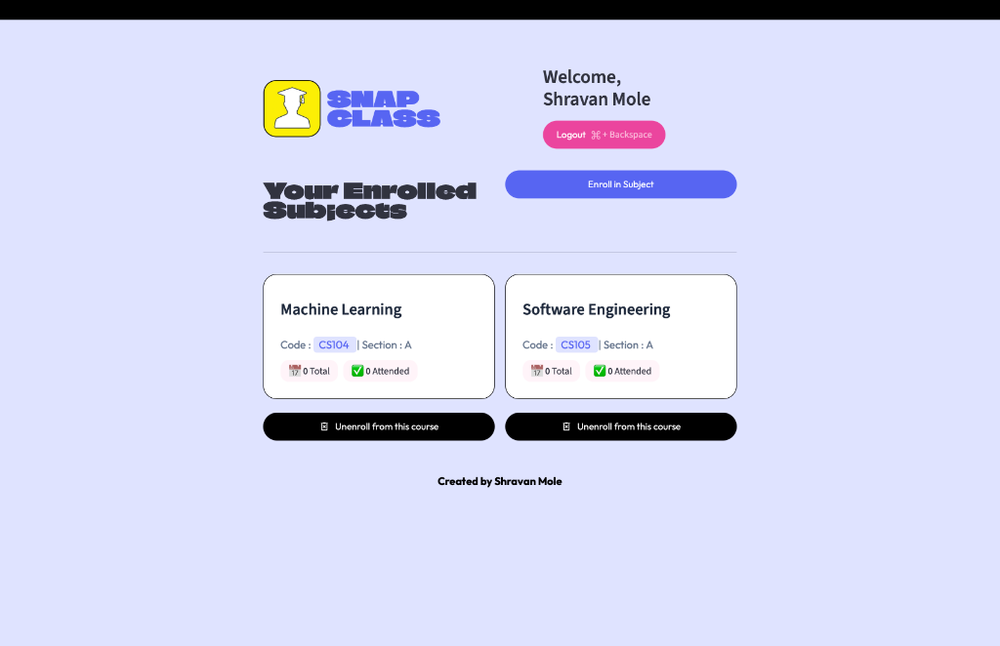
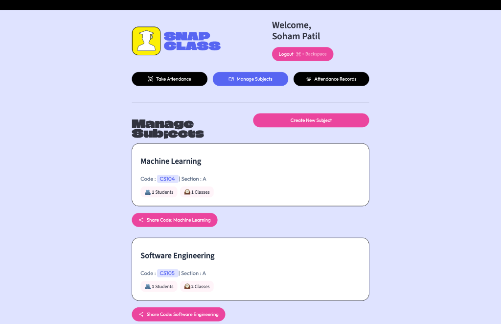
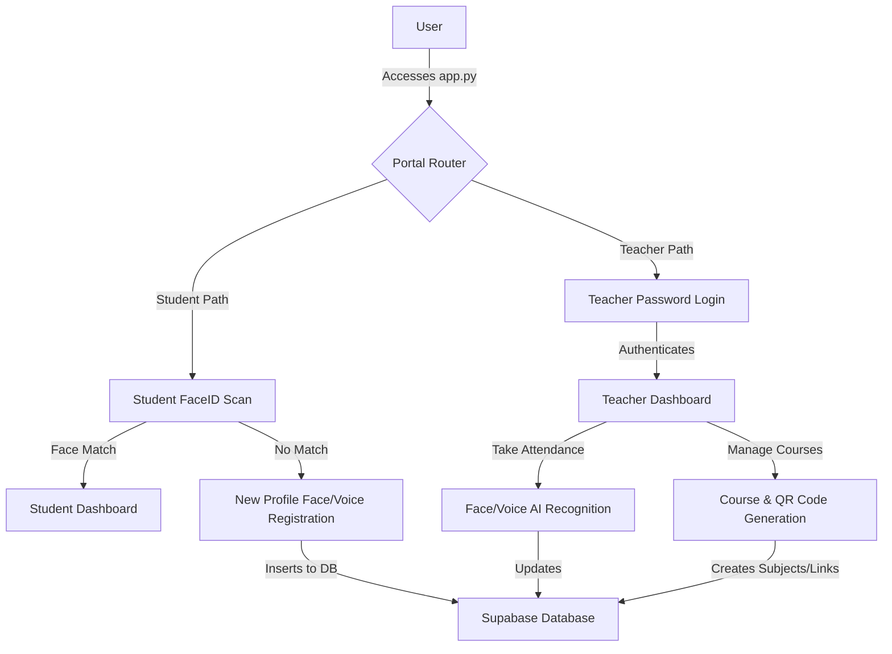

# 🎓 SnapClass
### AI-Powered Smart Attendance Management System

[](https://www.python.org/)
[](https://streamlit.io/)
[](https://supabase.com/)
[](https://scikit-learn.org/)
[](https://opensource.org/licenses/MIT)

---

<!-- Banner Image Here -->


---

## 📌 Project Description

**SnapClass** is an industry-standard, AI-powered smart attendance management system designed to modernize and simplify classroom and corporate attendance tracking. Traditional attendance methods—such as calling out names or passing around paper sheets—are highly inefficient, prone to errors, and vulnerable to academic dishonesty (e.g., "proxy attendance" or "buddy punching"). SnapClass solves these challenges by integrating advanced biometric pipelines into a unified, secure, and intuitive web interface.

### The Core Problem and Solution
In large classrooms or lecture halls, manual attendance recording wastes valuable instructional time. By replacing manual workflows with biometrics, SnapClass records attendance in seconds. 
*   **For Teachers**: The platform offers automated bulk-classroom photo scanning using advanced Face Recognition models, and voice authentication using speaker verification profiles. Teachers can create courses, generate join URLs, view attendance logs, and track statistics from a centralized dashboard.
*   **For Students**: A quick FaceID login authenticates the student, redirects them to their personal portal, and registers their presence. Students can easily view their enrollment history and track their attendance rates.

By leveraging a serverless database (Supabase), high-precision feature extractors (Dlib, Resemblyzer), and clean styling layouts, SnapClass introduces a secure, real-time approach to tracking student presence.

---

## 🚀 Features

### 🔐 Authentication & Access
*   **Student FaceID Login**: Biometric login using real-time camera feeds to verify student identity.
*   **Teacher Password Login**: Secure username and password login using hashed storage (`bcrypt`).
*   **Dual Portal Routing**: Intelligent session state routing that customizes dashboards for students and teachers.
*   **Student Face Registration**: Instant registration screen that captures face details for unrecognized students.

### 📊 Attendance Tracking
*   **AI Face Recognition Attendance**: Scans classroom photos (uploaded or live-captured) to identify all present students.
*   **AI Voice Recognition Attendance**: Bulk audio upload/capture to recognize students saying phrases like "I am present" based on their pre-registered voice prints.
*   **Attendance Statistics**: Real-time summaries displaying the number of sessions attended vs. total classes held.
*   **Exportable Records**: Full logs displaying time, student name, course details, and presence logs.

### 🛠️ Course Management
*   **Unique Course Codes**: Automatically creates alphanumeric identifiers for new subjects.
*   **Course Linking and QR Codes**: Generates unique sharing links and QR codes via `segno` for WhatsApp/Email distribution.
*   **Auto-Enrollment Handling**: Dynamic URL parameter listening (`?join-code=CS101`) to automatically enroll students upon logging in.
*   **Unenroll Support**: Simple dashboard actions allowing students to leave subjects instantly.

---

## 🎨 Screenshots

### Home Screen


### Student Dashboard


### Teacher Dashboard


---

## 🛠️ Tech Stack

| Category | Technology | Usage in SnapClass |
| :--- | :--- | :--- |
| **Frontend UI** | Streamlit (v1.58+) | Web framework, interactive inputs, layout, and component state management. |
| **Database** | Supabase | Postgres database, REST client storage, and user credentials. |
| **AI Library** | dlib | Facial landmark extraction and HOG face detection. |
| **AI Models** | face_recognition_models | Pre-trained facial recognition network weights. |
| **Voice Biometrics** | Resemblyzer | Extracts speaker identification embeddings (D-Vectors) from audio signals. |
| **Audio Processing** | Librosa | Loads wav streams and performs silent gap/voice segment splitting. |
| **Machine Learning** | Scikit-Learn | Support Vector Machine (SVC) classifier for matching face embeddings. |
| **Cryptography** | Bcrypt | Password hashing and validation for teacher security. |
| **QR Generator** | Segno | Generates QR codes for class registration links. |
| **Data Handling** | Pandas / NumPy | Tabular reporting, log compiling, and matrix calculations. |
| **Image Handling** | Pillow | Conversions and array transformations for image pipelines. |

---

## 📐 Project Architecture



### Architectural Details
1.  **Entry Point (`app.py`)**: Automatically captures route query variables (`?join-code=`) and handles session states.
2.  **Authentication Layer**: Teachers log in using passwords verified via `bcrypt`. Students authenticate by capturing a webcam frame, extracting a 128D face descriptor, and running it through a Support Vector Machine (SVC) classifier.
3.  **Core Dashboard Screens**: Distributes dashboard components recursively using Streamlit tabs.
4.  **AI Biometric Pipeline**: Decoupled processes that isolate image recognition from audio verification features.
5.  **Database Layer**: Leverages PostgREST via Supabase SDK to run CRUD transactions safely.

---

## 📂 Folder Structure

```
snapclass/
│
├── app.py                      # Application entry point and routing config
├── requirements.txt            # Project dependencies list
├── .gitignore                  # Git untracked patterns
│
├── .streamlit/
│   └── secrets.toml            # Supabase API endpoints and key credentials
│
├── supabase/
│   └── migrations/
│       └── 20260705000000_fix_enrollment_constraints.sql  # SQL schema constraints migration
│
└── src/
    ├── components/
    │   ├── dialog_add_photo.py          # Teacher dialog to upload attendance photos
    │   ├── dialog_attendance_results.py # Teacher dialog to review and commit attendance logs
    │   ├── dialog_auto_enroll.py        # Automatic enrollment modal triggered by URL params
    │   ├── dialog_create_subject.py     # Modal to add new subject courses
    │   ├── dialog_enroll.py             # Student dialog to join subjects via course code
    │   ├── dialog_share_subject.py      # QR code generation and WhatsApp share links
    │   ├── dialog_voice_attendance.py   # Modal to execute voice recognition scans
    │   ├── footer.py                    # Shared page footers
    │   ├── header.py                    # Shared page headers
    │   └── subject_card.py              # Visual presentation of subject metrics
    │
    ├── database/
    │   ├── config.py           # Supabase client instantiation
    │   └── db.py               # Main database queries (Students, Teachers, Classes)
    │
    ├── pipelines/
    │   ├── face_pipeline.py    # Dlib/SVC face embedding extraction and identification
    │   └── voice_pipeline.py   # Resemblyzer voice embedding extraction and speaker matching
    │
    ├── screens/
    │   ├── home_screen.py      # Entry screen routing to portals
    │   ├── student_screen.py   # Student login, registration, and subject lists
    │   └── teacher_screen.py   # Teacher authentication and management tabs
    │
    └── ui/
        └── base_layout.py      # Base layouts, custom CSS definitions, and colors
```

---

## 🔧 Installation

### 1. Clone the Repository
```bash
git clone https://github.com/shravan12092005/snapclass.git
cd snapclass
```

### 2. Create Virtual Environment
*   **Windows**:
    ```bash
    python -m venv venv
    venv\Scripts\activate
    ```
*   **macOS / Linux**:
    ```bash
    python3 -m venv venv
    source venv/bin/activate
    ```

### 3. Install Dependencies
```bash
pip install -r requirements.txt
```
> ⚠️ **Note**: Installing `dlib` requires C++ compilers (like Build Tools for Visual Studio on Windows or Xcode Command Line Tools on macOS).

### 4. Configure Environment Secrets
Create a `.streamlit/secrets.toml` file in the root directory:
```toml
SUPABASE_URL = "https://your-project-ref.supabase.co"
SUPABASE_KEY = "your-supabase-anon-or-service-role-key"
```

---

## 💻 Running the Project

Start the Streamlit application using the environment's python/streamlit command:
```bash
streamlit run app.py
```
Open `http://localhost:8501` (or the console-defined URL) in your web browser.

---

## 🔐 Authentication & Attendance Workflows

### Face ID Login Pipeline
```
Student -> Captures Camera Frame -> Extracts Face Descriptor -> Match Embeddings via SVC
                                                                     │
                                                    ┌────────────────┴────────────────┐
                                                    ▼                                 ▼
                                              [Match Found]                    [No Match Found]
                                                    │                                 │
                                            Redirect to Dashboard              Redirect to Register
```

### Full Class Attendance Pipeline
```
Teacher uploads Classroom Photo -> Extracts Multiple Face Embeddings -> Compares with Student DB
                                                                                  │
                                                    ┌─────────────────────────────┴─────────────────────────────┐
                                                    ▼                                                           ▼
                                         [Embedded Distance <= 0.6]                                  [Embedded Distance > 0.6]
                                                    │                                                           │
                                        Status: ✅ Present                                          Status: ❌ Absent
                                                    └─────────────────────────────┬─────────────────────────────┘
                                                                                  ▼
                                                                  Logs saved in Database (attendance_logs)
```

---

## 🧠 Face Recognition Pipeline

SnapClass utilizes a custom-built processing pipeline powered by machine learning and computer vision:

1.  **Face Detection**: Utilizes **HOG (Histogram of Oriented Gradients)** coupled with a linear classifier to scan the image for face locations.
2.  **Landmark Extraction**: Uses a pre-trained **68-point shape predictor** models to detect facial landmarks (eyes, nose, jawline, mouth).
3.  **Feature Encoding**: Computes a **128-dimensional vector** (face embedding descriptor) utilizing a deep ResNet feature extractor.
4.  **Classification**: Fits a **Support Vector Machine (SVC)** classifier dynamically with the student profiles database:
    *   **Kernel**: Linear kernel for rapid separating hyperplanes.
    *   **Class Weight**: Balanced to adjust weights inversely proportional to class frequencies.
5.  **Threshold Comparison**: Employs a Euclidean L2-norm distance calculation with a resemblance threshold of `0.6` to confirm student matching.

---

## 🎙️ Voice Recognition Pipeline (Speaker Verification)

SnapClass features an optional fallback/verification speaker recognition pipeline:
1.  **Voice Profile Extraction**: Extracts a speaker embedding (a 256-dimensional D-Vector representing the speaker's vocal characteristics) using `Resemblyzer`'s deep neural networks.
2.  **Classroom Audio Splitting**: Employs `librosa`'s silent gap splitting algorithms (`librosa.effects.split` with `top_db=30`) to isolate individual spoken audio packets from bulk recordings.
3.  **Speaker Match**: Computes the **cosine similarity** (dot product of normalized embedding vectors) between the live utterance segments and registered students' voice profiles. 

---

## 🔒 Security Features
*   **Credential Protection**: Secure password hashing implemented using `bcrypt` (12-round salt derivation).
*   **Serverless Security Configuration**: Supabase environment credentials kept server-side in Streamlit secrets.
*   **Row-Level Security**: Enabled `subject_students` and `attendance_logs` policies preventing unauthorized read/writes.

---

## 📄 License
Distributed under the MIT License. See `LICENSE` for more information.

---

## 👥 Author
**Shravan Mole**
*   **GitHub**: [@shravan12092005](https://github.com/shravan12092005)
*   **LinkedIn**: [Shravan Mole](https://www.linkedin.com/in/shravan-mole/)
*   **Email**: [shravanmole9383@gmail.com](mailto:shravanmole9383@gmail.com)

---

## 🎁 Acknowledgements
*   [Streamlit Documentation](https://docs.streamlit.io/)
*   [Supabase Database](https://supabase.com/docs)
*   [dlib C++ Library](http://dlib.net/)
*   [Resemblyzer Voice Extraction](https://github.com/resemble-ai/Resemblyzer)
