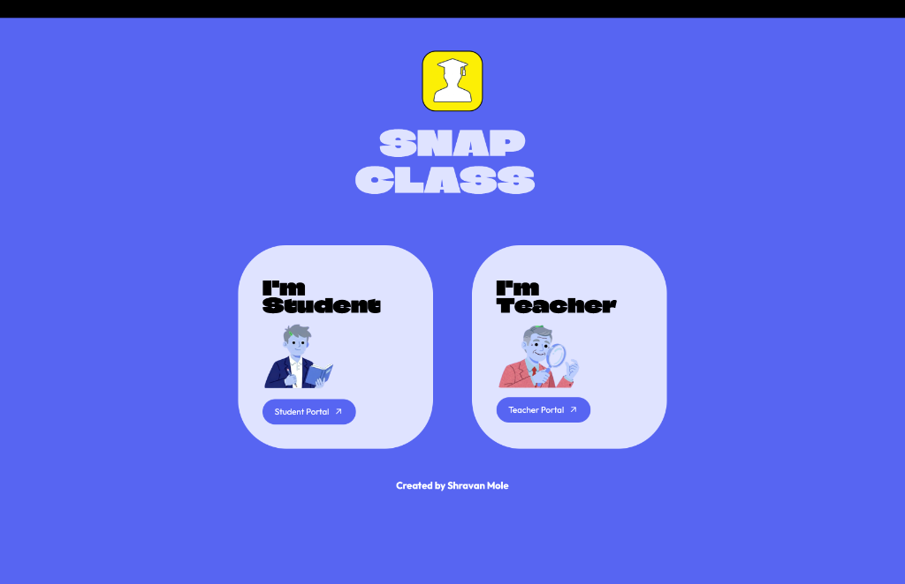
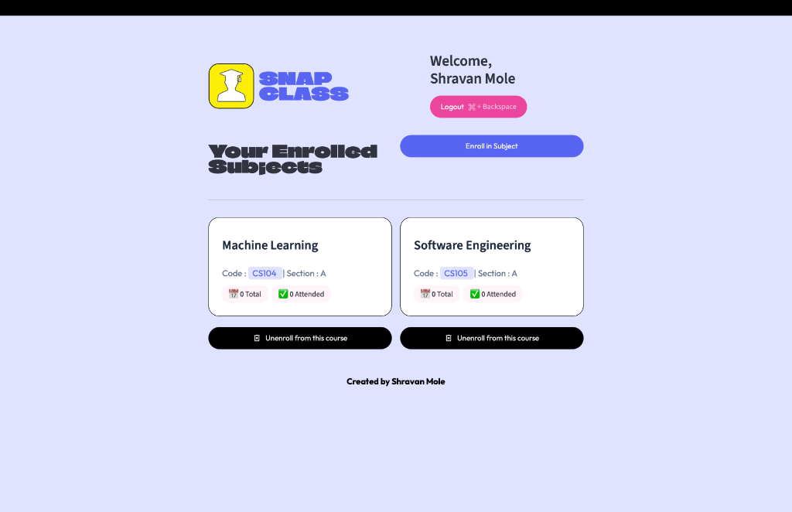
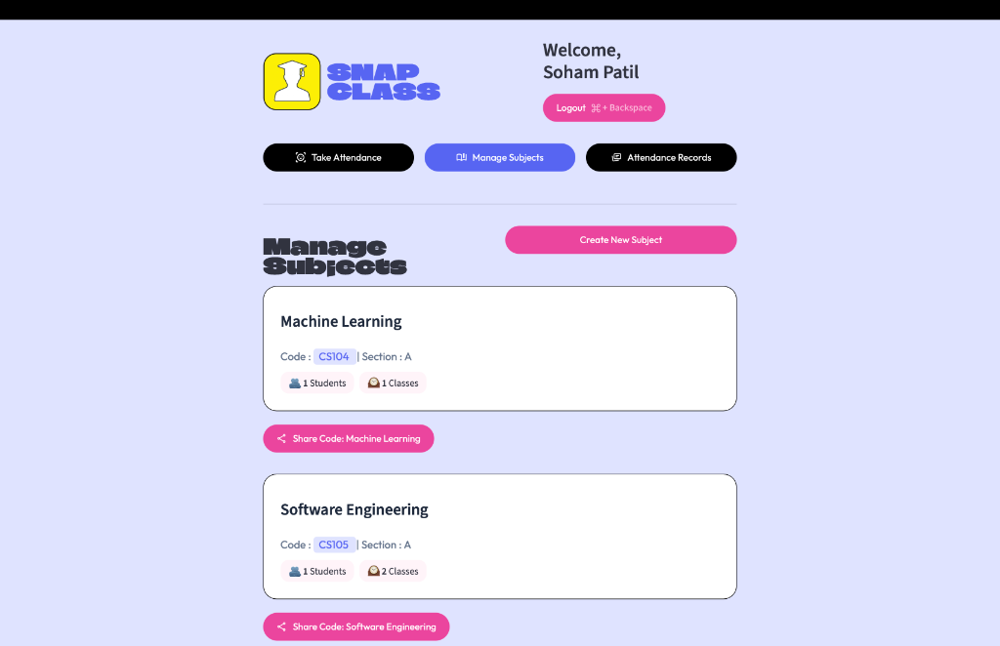
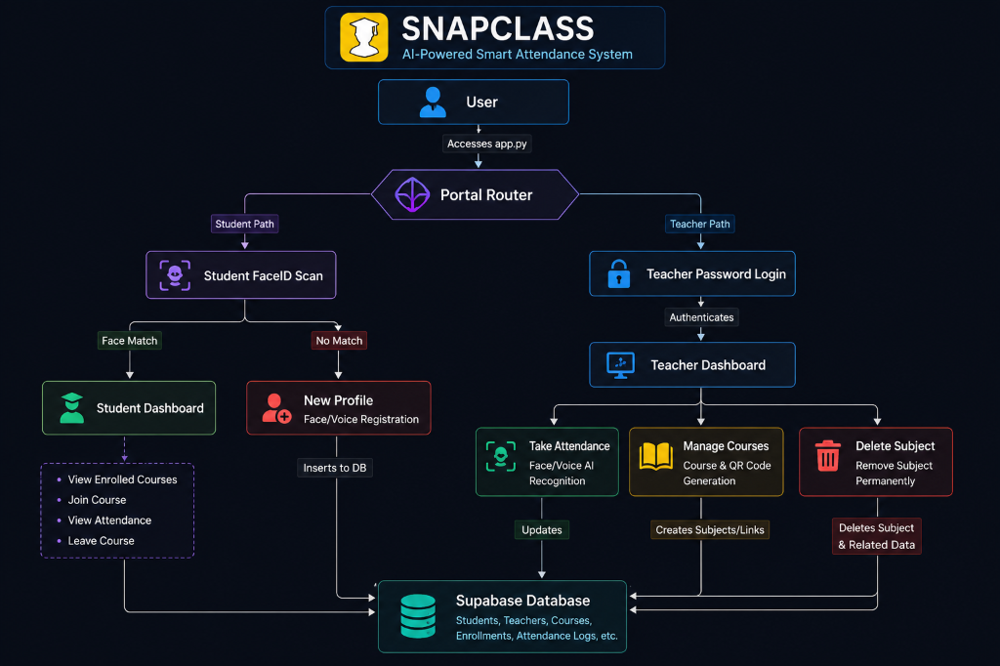

# 🎓 SnapClass
### AI-Powered Smart Attendance Management System

[](https://www.python.org/)
[](https://streamlit.io/)
[](https://supabase.com/)
[](https://opensource.org/licenses/MIT)

## 📌 Project Description

**SnapClass** is an AI-powered smart attendance management system designed to modernize and simplify classroom attendance tracking. Traditional attendance methods—such as calling out names or passing around paper sheets—are inefficient, prone to errors, and vulnerable to proxy attendance. SnapClass solves these challenges by integrating facial and voice biometric pipelines into a unified, secure Streamlit web interface.

### The Core Problem and Solution
In large classrooms or lecture halls, manual attendance recording wastes valuable instructional time. By replacing manual workflows with biometrics, SnapClass records attendance in seconds:
*   **For Teachers**: The platform offers automated bulk-classroom photo scanning using face recognition models and voice authentication using speaker verification profiles. Teachers can create courses with auto-generated unique codes, generate QR join links, view attendance logs, inspect rosters, export CSV reports, and track statistics from a centralized dashboard.
*   **For Students**: A quick FaceID login authenticates the student, redirects them to their personal portal, and registers their presence. Students can easily view their enrollment history and track their attendance rates.

By leveraging a serverless database (Supabase), high-precision feature extractors (dlib, Resemblyzer), and clean styling layouts, SnapClass introduces a secure, real-time approach to tracking student presence.

---

## 🚀 Features

### 🔐 Authentication & Access
*   **Student FaceID Login**: Biometric login using real-time camera feeds to verify student identity with ambiguity margin checking.
*   **Teacher Password Login**: Secure username and password login using hashed storage (`bcrypt`).
*   **Dual Portal Routing**: Intelligent session state routing that customizes dashboards for students and teachers.
*   **Biometric Consent & Registration**: Instant registration screen with explicit consent checkboxes before capturing face and voice biometrics.
*   **Student Profile Deletion**: GDPR-compliant "Delete my profile and data" option that cascades across all enrollments and logs.

### 📊 Attendance Tracking
*   **AI Face Recognition Attendance**: Scans classroom photos (uploaded or live-captured), using tiled scanning on high-res photos to prevent missing back-row faces, and matches against subject-enrolled candidates.
*   **AI Voice Recognition Attendance**: Bulk audio upload/capture to recognize students saying phrases like "I am present" based on their pre-registered voice prints. Students without voice profiles are flagged and excluded from automated absences so teachers can mark them manually.
*   **Interactive Attendance Overrides**: Allows teachers to review AI-detected attendance in an interactive card grid and manually toggle presence status ("Mark Present" / "Mark Absent") for each student before saving.
*   **Attendance Statistics & Trends**: Real-time summaries displaying session counts, attendance percentages, and chronological trend charts sorted by actual timestamp.
*   **Exportable Records**: Full logs displaying session timestamps, student names, course details, and presence status with one-click CSV export.

### 🛠️ Course Management
*   **Server-Side Unique Course Codes**: Automatically creates collision-resistant 6–8 uppercase alphanumeric identifiers for new subjects.
*   **Course Linking and QR Codes**: Generates unique sharing links and QR codes via `segno` for WhatsApp/Email distribution.
*   **Auto-Enrollment Handling**: Dynamic URL parameter listening (`?join-code=CS101`) to automatically enroll students upon logging in.
*   **Class Roster Inspector**: On-demand single-query roster analytics displaying enrolled students, individual attendance rates, and one-click student removal.
*   **Unenroll Support**: Simple dashboard actions allowing students to leave subjects instantly.
*   **Subject Deletion Support**: Clean delete option for teachers with atomic `ON DELETE CASCADE` foreign keys removing associated enrollments and logs.

---

## 🎨 Screenshots

### Home Screen


### Student Dashboard


### Teacher Dashboard


---

## 🛠️ Tech Stack

| Category | Technology | Usage in SnapClass |
| :--- | :--- | :--- |
| **Frontend UI** | Streamlit (v1.48+) | Web framework, interactive inputs, layout, and component state management. |
| **Database** | Supabase (PostgreSQL) | Relational database, REST client storage, RLS security policies, and foreign keys. |
| **Face Detection** | dlib | Facial landmark extraction and HOG frontal face detection. |
| **Face Models** | face_recognition_models | Pre-trained deep ResNet facial recognition descriptor network weights. |
| **Voice Biometrics** | Resemblyzer | Extracts speaker identification embeddings (D-Vectors) from audio signals. |
| **Audio Processing** | Librosa | Loads audio streams and performs silent gap/voice segment splitting. |
| **Cryptography** | Bcrypt | Password hashing and validation with salted rounds for teacher security. |
| **QR Generator** | Segno | Generates QR codes for class registration links. |
| **Data Handling** | Pandas / NumPy | Tabular reporting, log compiling, vector similarity, and matrix calculations. |
| **Image Handling** | Pillow | EXIF orientation normalization, image conversions, and array transformations. |

---

## 📐 Project Architecture



### Architectural Details
1.  **Entry Point (`app.py`)**: Captures route query variables (`?join-code=`) and handles session state routing.
2.  **Authentication Layer**: Teachers log in using passwords verified via `bcrypt`. Students authenticate by capturing a webcam frame, extracting a 128D face descriptor, and matching it against registered embeddings using Euclidean distance with ambiguity margin checks.
3.  **Core Dashboard Screens**: Distributes dashboard components recursively using Streamlit tabs and fragments.
4.  **AI Biometric Pipeline**: Decoupled processes that isolate image recognition from audio verification features.
5.  **Database Layer**: Leverages PostgREST via Supabase SDK to run CRUD transactions safely with custom `DatabaseError` propagation.

---

## 📂 Folder Structure

```
snapclass/
│
├── app.py                      # Application entry point and routing config
├── requirements.txt            # Pinned project dependencies
├── .gitignore                  # Git untracked patterns
├── LICENSE                     # MIT License
│
├── .streamlit/
│   ├── secrets.toml.example    # Template for Supabase credentials
│   └── secrets.toml            # Supabase API endpoints and service key (git-ignored)
│
├── supabase/
│   └── migrations/
│       ├── 20260705000000_fix_enrollment_constraints.sql
│       └── 20261005000000_full_base_schema.sql  # Full idempotent schema, ON DELETE CASCADE, RLS
│
└── src/
    ├── components/
    │   ├── dialog_add_photo.py          # Teacher dialog to upload attendance photos (EXIF-aware)
    │   ├── dialog_attendance_results.py # Teacher dialog to review and commit attendance logs
    │   ├── dialog_auto_enroll.py        # Automatic enrollment modal triggered by URL params
    │   ├── dialog_create_subject.py     # Modal to add new subject courses with server-generated codes
    │   ├── dialog_delete_subject.py     # Confirmation dialog for cascading subject deletion
    │   ├── dialog_enroll.py             # Student dialog to join subjects via course code
    │   ├── dialog_share_subject.py      # QR code generation and WhatsApp share links
    │   ├── dialog_voice_attendance.py   # Modal to execute voice recognition scans
    │   ├── footer.py                    # Shared page footers
    │   ├── header.py                    # Shared page headers
    │   └── subject_card.py              # Visual presentation of subject metrics (HTML-escaped)
    │
    ├── database/
    │   ├── config.py           # Supabase client instantiation (service-role key support)
    │   ├── exceptions.py       # Custom DatabaseError exception class
    │   └── db.py               # Database queries, pagination, caching, and atomic cascades
    │
    ├── pipelines/
    │   ├── face_pipeline.py    # dlib face embedding extraction, tiled scanning, and threshold matching
    │   └── voice_pipeline.py   # Resemblyzer voice embedding extraction and speaker matching
    │
    ├── screens/
    │   ├── home_screen.py      # Entry screen routing to student/teacher portals
    │   ├── student_screen.py   # Student login, registration, consent, and subject lists
    │   └── teacher_screen.py   # Teacher authentication, course management, and records analytics
    │
    └── ui/
        └── base_layout.py      # Base layouts, custom CSS definitions, and colors
```

---

## 🔧 Installation

### 1. Prerequisites
*   **Python**: Version **3.10+** (Python 3.10 to 3.12 recommended).
*   **C++ Compiler**: Installing `dlib` requires C++ compilers (Visual Studio C++ Build Tools on Windows, Xcode Command Line Tools on macOS, or `build-essential` on Linux).

### 2. Clone the Repository
```bash
git clone https://github.com/shravan12092005/snapclass.git
cd snapclass
```

### 3. Create Virtual Environment
*   **Windows**:
    ```bash
    python -m venv venv
    venv\Scripts\activate
    ```
*   **macOS / Linux**:
    ```bash
    python3 -m venv venv
    source venv/bin/activate
    ```

### 4. Install Dependencies
```bash
pip install -r requirements.txt
```

### 5. Configure Environment Secrets
Copy `.streamlit/secrets.toml.example` to `.streamlit/secrets.toml`:
```bash
cp .streamlit/secrets.toml.example .streamlit/secrets.toml
```

Edit `.streamlit/secrets.toml` with your Supabase credentials:
```toml
SUPABASE_URL = "https://your-project-ref.supabase.co"

# Service-role key (server-side, bypasses RLS). Keep this secret!
SUPABASE_SERVICE_KEY = "your-supabase-service-role-key"

# Backwards compatibility fallback (if service key is not yet set)
SUPABASE_KEY = "your-supabase-service-or-anon-key"
```

---

## 💻 Running the Project

Start the Streamlit application:
```bash
streamlit run app.py
```
Open `http://localhost:8501` in your web browser.

---

## 🔐 Authentication & Attendance Workflows

### Face ID Login Pipeline
```
Student -> Captures Camera Frame -> EXIF Transpose -> Extracts Face Descriptor
                                                               │
                                         ┌─────────────────────┴─────────────────────┐
                                         ▼                                           ▼
                            [Best dist <= 0.5 & Margin >= 0.05]           [Dist > 0.5 or Ambiguous]
                                         │                                           │
                               Redirect to Dashboard                       Redirect to Register
```

### Full Class Attendance Pipeline
```
Teacher uploads Classroom Photo -> Tiled Scanning (>1024px) -> Extracts Face Embeddings
                                                                          │
                                            ┌─────────────────────────────┴─────────────────────────────┐
                                            ▼                                                           ▼
                             [Candidate Distance <= 0.6]                                 [Candidate Distance > 0.6]
                                            │                                                           │
                                Status: ✅ Present                                          Status: ❌ Absent
                                            └─────────────────────────────┬─────────────────────────────┘
                                                                          ▼
                                                       Interactive Override & Confirmation
                                                                          │
                                                                          ▼
                                                       Committed to DB (attendance_logs)
```

---

## 🧠 Face Recognition Pipeline

SnapClass utilizes a processing pipeline powered by computer vision:

1.  **Image Normalization**: Applies `PIL.ImageOps.exif_transpose` to ensure camera/mobile images match correct physical orientation.
2.  **Face Detection**: Utilizes dlib's **HOG (Histogram of Oriented Gradients)** detector coupled with a linear classifier to locate faces. For images larger than 1024px, scans overlapping tiles to preserve small, distant faces in large lecture halls.
3.  **Landmark Extraction**: Uses a pre-trained **68-point shape predictor** to normalize facial poses (eyes, nose, jawline, mouth).
4.  **Feature Encoding**: Computes a **128-dimensional vector** (face embedding descriptor) utilizing a deep ResNet feature extractor.
5.  **Distance Matching**:
    *   **Classroom Matching**: Evaluates Euclidean L2-norm distances against subject-enrolled students with a threshold of `0.6`.
    *   **Login Verification**: Uses a stricter threshold of `0.5` alongside a margin requirement of `0.05` between the best and second-best candidate to prevent impersonation.
    *   **Embedding Deduplication**: Removes duplicate detections across overlapping image tiles based on embedding distance (`< 0.25`).

---

## 🎙️ Voice Recognition Pipeline (Speaker Verification)

SnapClass features an optional speaker verification pipeline:
1.  **Voice Profile Extraction**: Extracts a 256-dimensional speaker embedding (D-Vector) using `Resemblyzer`.
2.  **Classroom Audio Splitting**: Employs `librosa`'s silent gap splitting algorithms (`librosa.effects.split` with `top_db=30`) to isolate individual spoken audio segments from bulk recordings.
3.  **Speaker Match**: Computes cosine similarity between live utterance segments and registered voice profiles with a matching threshold of `0.65`. Students without registered voice profiles are displayed as "No voice profile" and are excluded from automatic absences so teachers can verify them manually.

---

## 🔒 Security Features
*   **Credential Protection**: Secure password hashing implemented using `bcrypt` with salted key derivation.
*   **Server-Side Secret Management**: Supabase credentials kept strictly server-side in Streamlit secrets.
*   **Row-Level Security (RLS)**: RLS is enabled on all tables (`teachers`, `students`, `subjects`, `subject_students`, `attendance_logs`) with no policies granted to the `anon` public role. Direct unauthenticated client access is fully denied; all operations are safely handled server-side via the Supabase service-role key (`SUPABASE_SERVICE_KEY`).
*   **Input Sanitization**: All user-supplied fields interpolated into HTML components are sanitized with `html.escape()` to prevent Cross-Site Scripting (XSS).

---

## 🩺 Troubleshooting

### Face Login returns "Service temporarily unavailable" (503)
The lockout store (Supabase `login_attempts` table) is unreachable. Check:
1. `SUPABASE_URL` and `SUPABASE_SERVICE_ROLE_KEY` are set correctly in `backend/.env`.
2. The `login_attempts` table and the `record_login_attempt` RPC function exist — run the migration in `supabase/migrations/`.
3. Backend startup logs will print `login_attempts table is reachable: yes/no` to help diagnose.

### Camera shows black frame or keeps restarting
- Ensure you're accessing the frontend over `localhost`, not `0.0.0.0` — browsers block `getUserMedia` on non-secure origins.
- The "Capture Face" button stays disabled until the video feed has data. Wait for the live preview to appear.
- After clicking "Retake Photo", the video feed re-attaches automatically. If it stays black, click "Try Camera Again".

### Cookies not sent / session lost between requests
- Set `COOKIE_SECURE=false` in `backend/.env` for local HTTP development.
- Set `DEV_MODE=true` so session and lockout secrets fall back to dev defaults.
- Make sure `CORS_ORIGINS` includes `http://localhost:3000` (exact match, no trailing slash).

### "Too many failed attempts" lockout during development
Clear the `login_attempts` table in Supabase to reset all lockouts:
```sql
DELETE FROM login_attempts;
```

---

## 📄 License
Distributed under the MIT License. See [LICENSE](LICENSE) for more information.

---

## 👥 Author
**Shravan Mole**
*   **GitHub**: [@shravan12092005](https://github.com/shravan12092005)
*   **LinkedIn**: [Shravan Mole](https://www.linkedin.com/in/shravan-mole-930818378)
*   **Email**: [shravanmole9383@gmail.com](mailto:shravanmole9383@gmail.com)

---

## 🎁 Acknowledgements
*   [Streamlit Documentation](https://docs.streamlit.io/)
*   [Supabase Database](https://supabase.com/docs)
*   [dlib C++ Library](http://dlib.net/)
*   [Resemblyzer Voice Extraction](https://github.com/resemble-ai/Resemblyzer)
